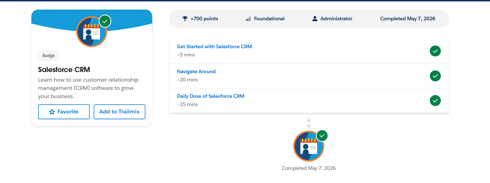

# Day 1

## 📌 Topics Learned
- What is Salesforce
- What is CRM
- Salesforce Developer Role
- Salesforce Playground
- Accounts, Contacts, Opportunities

---

# 1️⃣ What is CRM?

CRM stands for Customer Relationship Management.

It is a system used by companies to manage:
- Customers
- Sales
- Communication
- Business workflows
- Customer support

CRM helps businesses store customer information in one place and improve relationships with customers.

Example:
A company can track:
- Who contacted them
- Which product the customer wants
- Sales progress
- Customer history

---

# 2️⃣ Why Companies Use Salesforce?

Salesforce is a cloud-based CRM platform.

Companies use Salesforce because it helps them:
- Manage customer data
- Track sales pipelines
- Automate business processes
- Improve customer support
- Increase productivity
- Generate reports and analytics

Salesforce is widely used because it is:
- Scalable
- Secure
- Cloud-based
- Easy to customize

---

# 3️⃣ Core Salesforce Concepts

## 🔹 Account

An Account represents a company or organization.

Example:
- Infosys
- TCS
- Amazon

Accounts store company-related information.

---

## 🔹 Contact
A Contact represents a person associated with an Account.

Example:
- Employee
- Customer
- Manager

Contacts store personal details like:
- Name
- Email
- Phone number

---

## 🔹 Opportunity
An Opportunity represents a potential business deal or sale.

It helps companies track:
- Deal stage
- Expected revenue
- Probability of closing the deal

Example:
A company planning to purchase software services.

---

# 4️⃣ Business Flow Understanding

## Lead → Contact → Opportunity → Customer

### Lead
A person or organization showing interest in a product or service.

Example:
A student filling out a college admission inquiry form.

↓

### Contact
After verification, the lead becomes a contact.

The company now has proper details of the person.

↓

### Opportunity
A possible business deal is created.

Example:
The student is likely to take admission.

↓

### Customer
When the deal is successfully completed, the person becomes a customer.

Example:
The student officially joins the college.

---

# 5️⃣ Real-World Mapping (College Admission System)

| Salesforce Term | Real-World Example |
|-----------------|-------------------|
| Account | College |
| Contact | Student |
| Lead | Student Inquiry |
| Opportunity | Admission Process |

---

# 6️⃣ Trailhead Playground

Today I learned:
- What a Salesforce Playground is
- How to create a Playground
- How to attempt Trailhead challenges
- Basic Salesforce environment navigation

---

# 7️⃣ Trailhead Modules Completed

✅ Salesforce Values: Quick Look  
✅ Salesforce Developer: Quick Look  
✅ Salesforce CRM  
✅ Trailhead Playground Management  

---

# 8️⃣ Screenshots

---

# 🎯 Day 1 Outcome

I understood:

- What Salesforce is
- What CRM means
- Basic business workflow
- Salesforce Playground setup
- Accounts, Contacts, and Opportunities

---

