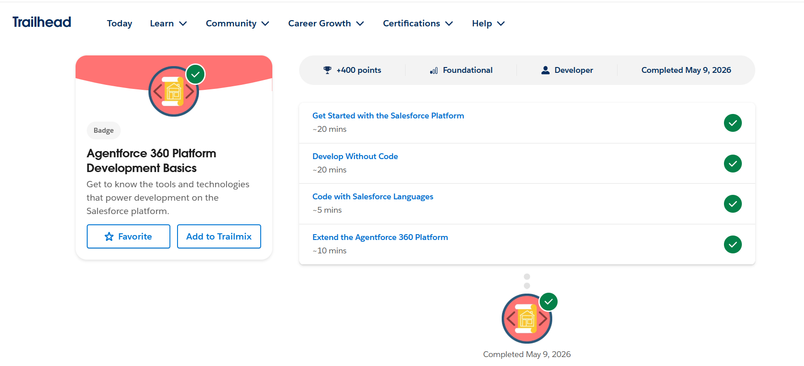

# Salesforce Summer Program - Day 2

# 📌 Topics Learned
- Salesforce Platform Basics
- Apps, Objects, and Tabs
- Salesforce Architecture
- Configuration vs Coding
- How Developers Extend Salesforce

---

# 1️⃣ What is Salesforce Platform?

Salesforce Platform is a cloud-based platform that allows businesses to:
- Manage customer relationships
- Build applications
- Store and manage data
- Automate workflows
- Extend functionality using code

It provides tools for:
- CRM
- Automation
- Reporting
- Development
- Security

Developers and admins can build business applications on top of the Salesforce Platform.

---

# 2️⃣ Salesforce Platform Structure

Salesforce platform is mainly organized using:
- Apps
- Objects
- Tabs

These components work together to create complete business systems.

---

# 3️⃣ What is an App in Salesforce?

An App in Salesforce is a collection of:
- Objects
- Tabs
- Features
- Tools

Apps are created for specific business purposes.

Examples:
- Sales App
- Service App
- HR App
- College Management App

Apps help users access related functionalities in one place.

---

# 4️⃣ What is an Object?

An Object is like a database table in Salesforce.

Objects store data records.

Examples:
- Account Object
- Contact Object
- Opportunity Object

Custom objects can also be created based on business needs.

Example:
- Student Object
- Patient Object
- Event Object

Each object contains:
- Fields
- Records
- Relationships

---

# 5️⃣ What is a Tab?

A Tab is the user interface used to access an object or feature.

Tabs help users:
- Open records
- View data
- Navigate easily

Example:
- Accounts Tab
- Contacts Tab
- Opportunities Tab

Tabs make Salesforce user-friendly.

---

## How CRM Concepts Fit into Salesforce Platform

CRM concepts are implemented inside Salesforce using Objects and Apps.

| CRM Concept | Salesforce Component |
|-------------|---------------------|
| Account | Standard Object |
| Contact | Standard Object |
| Opportunity | Standard Object |

These objects are grouped inside Apps such as the Sales App.

Users interact with these objects through Tabs.

Example Flow:
- Sales team opens Sales App
- Uses Account Tab to manage companies
- Uses Contact Tab to manage customers
- Uses Opportunity Tab to track deals

---

# 6️⃣ Difference Between Configuration and Coding

| Configuration (No Code) | Coding (Apex) |
|--------------------------|---------------|
| Uses clicks and setup tools | Uses programming |
| Faster and easier | More flexible |
| Used for simple automation | Used for complex logic |
| Done by Admins | Done by Developers |

---

# 7️⃣ When Should We Use Configuration?

Configuration should be used when requirements are simple and can be handled using built-in Salesforce tools.

## Examples:
1. Creating validation rules
2. Creating workflows or flows

Advantages:
- Faster development
- Less maintenance
- No coding knowledge required

---

# 8️⃣ When Should We Use Coding (Apex)?

Coding should be used when business logic becomes complex and cannot be solved using configuration alone.

## Examples:
1. Complex approval logic
2. Integration with external systems using APIs

Advantages:
- More customization
- Handles advanced business requirements
- Better control over functionality

---

# 9️⃣ Multi-Tenant Architecture

Salesforce uses Multi-Tenant Architecture.

This means:
- Multiple companies share the same Salesforce infrastructure
- Data remains secure and isolated
- Resources are shared efficiently

Benefits:
- Lower cost
- Automatic updates
- High scalability
- Better performance

This is one reason why Salesforce is different from traditional software systems.

---

# 🔟 Real System Design (College Admission System)

## App Name
College Admission Management App

---

## Objects Inside the App

### Standard Objects
- Account
- Contact
- Opportunity

### Custom Objects
- Student
- Course
- Admission Application

---

## How Users Interact With the System

### Admission Staff
- Create student records
- Track admission applications
- Manage course enrollments

### Students
- Submit applications
- Provide documents
- Track admission status

### Management
- Monitor admissions
- Generate reports
- Analyze student data

Users access these features through Tabs inside the App.

---

---

# 🎯 Day 2 Outcome

By the end of Day 2, I understood:
- Salesforce platform structure
- Apps, Objects, and Tabs
- Configuration vs Coding
- Multi-tenant architecture
- How CRM concepts fit into Salesforce platform

---

